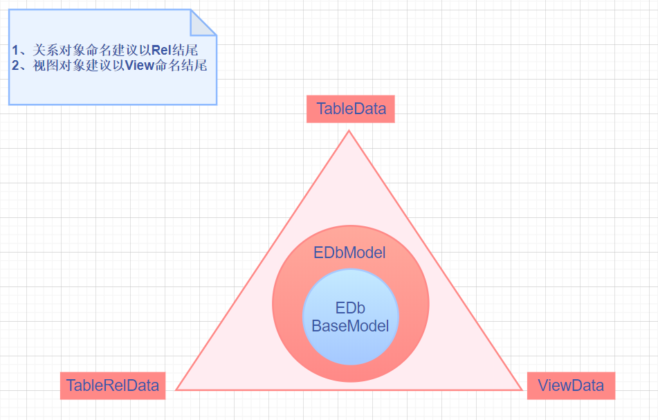

# EDb之 @EDbRel 案例介绍

### JPA使用指南 javax.persistence 的注解配置讲解
- @Table -- 基于 JPA 对象必须在实体类名上添加1个 @Table 注解，并指明数据库表的实际名称
- @Id -- 基于 JPA 对象必须至少指定1个主键字段申明
- @Column -- 基于 JPA 对象，@Column 是申明该属性字段对应的数据库实际名称，如果没有申明，则不会对数据库记录产生任何变化

### EDb自定义注解讲解
- @EDbSave 定义jpa保存前的执行方法
  - 作用域：
    - save(T)
    - batchSaveRid(class<T>,List<T>,int)
    - batchSave(class<T>,List<T>,int)
- @EDbUpdate 定义jpa更新前的执行方法
  - 作用域：
    - update(T)
    - update(class<T>,Map)
    - update(T1,T2)
    - batchUpdate(class<T>,List<T>,int)
    
- @EDbRel 关系对象定义
  - relKey -- 如果指定了，则可以通过key值的方式才能进行关系对象的动态赋值，例如使用 edbpro.getRelKey 方法
  - relColumn -- String[] 指定关联表相对字段，例如A表主键和B表的外键命名一样，即可直接维护，如果不是，请在 appendSql 里直接维护
  - appendSql -- 编写关联sql语句，以 and 或 or 开头，例如 and rel_id = #(p_id) , 意思是说关联对象的 rel_id 字段会获取当前源对象 上的 p_id 字段的值进行赋予，结果为 and rel_id = ? => and rel_id = 100
  - limit -- 在返回结果为list的时候有效,避免关联的是例如行为轨迹的表信息，可以有效的控制返回最近的轨迹信息
  - offset -- 可单向指定分页查询返回记录条数时，不用特意去统计获取结果，而是根据翻页传入 从第几条开始读取记录，节省开销时使用
 
### EDb数据视图定义 
  
    
### EDb审计对象（监听对象）讲解
- EDbListener.java 定义全局jpa对象保存、更新前的方法，在 @EDbSave @EDbUpdate 定义的方法执行之前触发


**基于Java的相关用例**

- [基于 @EDbRel 相关的测试案例](../../src/test/java/com/edb/cloud/jfinal/activerecord/db/jpa/JpaRelTest.java)

**基于 @EDbRel 关联对象注解测试案例 -- 同步返回之测试案例 -- 基本常用的方式 **

```sql

package com.edb.cloud.jfinal.activerecord.db.jpa;


import cn.hutool.core.util.ReUtil;
import cn.hutool.json.JSONUtil;
import com.alibaba.druid.pool.DruidDataSource;
import com.edb.cloud.jfinal.activerecord.db.EDb;
import com.edb.cloud.jfinal.activerecord.db.EDbPro;
import com.edb.cloud.jfinal.activerecord.db.base.BaseTest;
import com.edb.cloud.jfinal.activerecord.db.jpa.model.CrVehicleType;
import com.edb.cloud.jfinal.activerecord.db.jpa.model.CrVehicleTypeModeRel;
import com.edb.cloud.jfinal.activerecord.db.jpa.util.JpaRelUtil;
import com.jfinal.kit.Kv;
import com.jfinal.plugin.activerecord.SqlPara;
import com.jfinal.template.Engine;
import com.jfinal.template.Template;
import org.testng.annotations.BeforeTest;
import org.testng.annotations.Test;

import java.util.ArrayList;
import java.util.List;
import java.util.Map;
import java.util.concurrent.Future;
import java.util.regex.Matcher;
import java.util.regex.Pattern;

/**
 * EDbRel 注解关系对象应用
 */
public class JpaRelTest extends BaseTest {

    // 不能直接赋予对象，需要在beforeTest里执行
    EDbPro eDbPro = null;

    @BeforeTest
    public void initBefor(){
        eDbPro =  EDb.use();
//        eDbPro =  EDb.use("xzw");
        // 做一次查询连接，减少起始jdbc首次执行的耗时偏高问题
        eDbPro.findById(VehicleType.class,1);
    }

    /**
     * @EDbRel 常用情况的测试案例
     */
    @Test
    public void testAllRel(){
        CrVehicleTypeModeRel crVehicleTypeModeRel = eDbPro.findById(CrVehicleTypeModeRel.class,1);
        System.out.println("当前对象信息:"+JSONUtil.toJsonStr(crVehicleTypeModeRel));
        // 查询该对象的所有关联对象信息
        eDbPro.getAllRel(crVehicleTypeModeRel);
        System.out.println("当前对象信息已扩展关联对象信息:"+JSONUtil.toJsonStr(crVehicleTypeModeRel));
    }

}

```


```sql

2020-11-19 14:23:00.207 [,] [main] DEBUG c.e.c.j.a.d.d.f.EDbDruidSqlLogFilter - [sqlLog,229] - edb-sql-real: select * from `cr_vehicle_type_mode_rel` where `vehicle_type_mode_rel_id` = '1'
当前对象信息:{"vehicleTypeModeId":1,"vehicleTypeId":100,"vehicleTypeModeRelId":1,"isDel":0}
2020-11-19 14:23:00.255 [,] [main] DEBUG c.e.c.j.a.d.d.f.EDbDruidSqlLogFilter - [sqlLog,229] - edb-sql-real:  select * from (select  *  from cr_vehicle_type where 1=1  and VEHICLE_TYPE_ID = '100'   and IS_DEL = 1    limit 1   offset 0   ) as edb_findFirst_tb limit 2
2020-11-19 14:23:00.257 [,] [main] DEBUG c.e.c.j.a.d.d.f.EDbDruidSqlLogFilter - [sqlLog,206] - edb-sql-?:  select * from (select  *  from cr_vehicle_type_mode where 1=1   and VEHICLE_TYPE_MODE_ID = ? and IS_DEL = 0     limit 1   offset 0   ) as edb_findFirst_tb limit 2
2020-11-19 14:23:00.258 [,] [main] DEBUG c.e.c.j.a.d.d.f.EDbDruidSqlLogFilter - [sqlLog,207] - edb-sql-params: {
  "0" : 1
}
2020-11-19 14:23:00.258 [,] [main] DEBUG c.e.c.j.a.d.d.f.EDbDruidSqlLogFilter - [sqlLog,229] - edb-sql-real:  select * from (select  *  from cr_vehicle_type_mode where 1=1   and VEHICLE_TYPE_MODE_ID = '1' and IS_DEL = 0     limit 1   offset 0   ) as edb_findFirst_tb limit 2
Disconnected from the target VM, address: '127.0.0.1:62898', transport: 'socket'
当前对象信息已扩展关联对象信息:{"vehicleTypeModeId":1,"vehicleTypeId":100,"vehicleTypeModeRelId":1,"crVehicleTypeMode":{"vehicleTypeModeId":1,"vehicleModeName":"款式1","isDel":0},"isDel":0,"crVehicleType":{"vehicleTypeId":100,"creator":"创建人-0","modifyTime":1605766696000,"createTime":1604826026000,"isDel":0,"vehicleTypeName":"罐车"}}

```


**基于 @EDbRel 关联对象注解测试案例 -- 同步返回之测试案例 **

```java
package com.edb.cloud.jfinal.activerecord.db.jpa;


import cn.hutool.core.util.ReUtil;
import cn.hutool.json.JSONUtil;
import com.alibaba.druid.pool.DruidDataSource;
import com.edb.cloud.jfinal.activerecord.db.EDb;
import com.edb.cloud.jfinal.activerecord.db.EDbPro;
import com.edb.cloud.jfinal.activerecord.db.base.BaseTest;
import com.edb.cloud.jfinal.activerecord.db.jpa.model.CrVehicleType;
import com.edb.cloud.jfinal.activerecord.db.jpa.model.CrVehicleTypeModeRel;
import com.edb.cloud.jfinal.activerecord.db.jpa.util.JpaRelUtil;
import com.jfinal.kit.Kv;
import com.jfinal.plugin.activerecord.SqlPara;
import com.jfinal.template.Engine;
import com.jfinal.template.Template;
import org.testng.annotations.BeforeTest;
import org.testng.annotations.Test;

import java.util.ArrayList;
import java.util.List;
import java.util.Map;
import java.util.concurrent.Future;
import java.util.regex.Matcher;
import java.util.regex.Pattern;

/**
 * EDbRel 注解关系对象应用
 */
public class JpaRelTest extends BaseTest {

    // 不能直接赋予对象，需要在beforeTest里执行
    EDbPro eDbPro = null;

    @BeforeTest
    public void initBefor(){
        eDbPro =  EDb.use();
//        eDbPro =  EDb.use("xzw");
        // 做一次查询连接，减少起始jdbc首次执行的耗时偏高问题
        eDbPro.findById(VehicleType.class,1);
    }

 /**
      * 关系对象应用测试
      */
     @Test
     public void testReL(){
         long start = System.currentTimeMillis();
         // 查询id为100的对象数据
         CrVehicleType crVehicleType  = eDbPro.findById(CrVehicleType.class,100);
         System.out.println("耗时:"+ (System.currentTimeMillis()-start) );
         start = System.currentTimeMillis();
         // 通过已查询到的对象，关联查询子对象 CrVehicleTypeModeRels
         List<CrVehicleTypeModeRel> crVehicleTypeModeRels = eDbPro.getRel(crVehicleType).getCrVehicleTypeModeRels();
         System.out.println("耗时:"+ (System.currentTimeMillis()-start) );
         start = System.currentTimeMillis();
         System.out.println("==>查询到的关联子对象集: " + crVehicleTypeModeRels.size());
         // 同时原对象也已赋值，如果重新用上面的读取数据库的方法，会重新刷新数据，如果不需要刷新，则可直接用该数据做对应的业务用途
         System.out.println("==>父对象引用的子对象集：" + crVehicleType.getCrVehicleTypeModeRels().size());
         // 断言验证结果
         assert(crVehicleTypeModeRels == crVehicleType.getCrVehicleTypeModeRels());
         System.out.println("==>通过@EDbRel注解，使用 eDbPro.getRel 方法，调用子对象时返回的结果集回调正常：");
         System.out.println("==>当前子对象:"+crVehicleTypeModeRels.get(0).getCrVehicleTypeMode());
         start = System.currentTimeMillis();
         // 同时，也可单独对子对象做业务对象的扩展关联获取，这种模式适合在后台独立模块独立操作时使用，节省内存节省开销，逐渐释放不需要的资源，比较轻量
         System.out.println("==>关联获取子对象:"+eDbPro.getRel(crVehicleTypeModeRels.get(0)).getCrVehicleTypeMode());
         System.out.println("耗时:"+ (System.currentTimeMillis()-start) );
         start = System.currentTimeMillis();
         // 加了标记，就必须使用指向的方式才能正常访问，或者是使用 getAllRel 返回结果集
 //        System.out.println(eDbPro.getRel(crVehicleTypeModeRels.get(0)).getDelCrVehicleType());
         // 如果用这种方式获取已删除的对象，会出现错误的返回结果
         System.out.println("指向@EDbRel的key:"+eDbPro.getRelKey(crVehicleTypeModeRels.get(0),CrVehicleTypeModeRel.noDel));
         System.out.println("耗时:"+ (System.currentTimeMillis()-start) );
         start = System.currentTimeMillis();
 
     }


}


```

```sql
2020-11-19 09:45:42.057 [,] [main] DEBUG c.e.c.j.a.d.d.f.EDbDruidSqlLogFilter - [sqlLog,206] - edb-sql-?: select * from `cr_vehicle_type` where `vehicle_type_id` = ?
2020-11-19 09:45:42.206 [,] [main] DEBUG c.e.c.j.a.d.d.f.EDbDruidSqlLogFilter - [sqlLog,207] - edb-sql-params: {
  "0" : 1
}
2020-11-19 09:45:42.206 [,] [main] DEBUG c.e.c.j.a.d.d.f.EDbDruidSqlLogFilter - [sqlLog,229] - edb-sql-real: select * from `cr_vehicle_type` where `vehicle_type_id` = '1'
2020-11-19 09:45:42.231 [,] [main] DEBUG c.e.c.j.a.d.d.f.EDbDruidSqlLogFilter - [sqlLog,206] - edb-sql-?: select * from `cr_vehicle_type` where `vehicle_type_id` = ?
2020-11-19 09:45:42.232 [,] [main] DEBUG c.e.c.j.a.d.d.f.EDbDruidSqlLogFilter - [sqlLog,207] - edb-sql-params: {
  "0" : 100
}
2020-11-19 09:45:42.232 [,] [main] DEBUG c.e.c.j.a.d.d.f.EDbDruidSqlLogFilter - [sqlLog,229] - edb-sql-real: select * from `cr_vehicle_type` where `vehicle_type_id` = '100'
耗时:32
2020-11-19 09:45:42.333 [,] [main] DEBUG c.e.c.j.a.d.d.f.EDbDruidSqlLogFilter - [sqlLog,206] - edb-sql-?: select  *  from cr_vehicle_type_mode_rel where 1=1  and VEHICLE_TYPE_ID = ?   limit 20   offset 0   
2020-11-19 09:45:42.333 [,] [main] DEBUG c.e.c.j.a.d.d.f.EDbDruidSqlLogFilter - [sqlLog,207] - edb-sql-params: {
  "0" : 100
}
2020-11-19 09:45:42.333 [,] [main] DEBUG c.e.c.j.a.d.d.f.EDbDruidSqlLogFilter - [sqlLog,229] - edb-sql-real: select  *  from cr_vehicle_type_mode_rel where 1=1  and VEHICLE_TYPE_ID = '100'   limit 20   offset 0   
耗时:86
==>查询到的关联子对象集: 5
==>父对象引用的子对象集：5
==>通过@EDbRel注解，使用 eDbPro.getRel 方法，调用子对象时返回的结果集回调正常：
==>当前子对象:null
2020-11-19 09:45:42.352 [,] [main] DEBUG c.e.c.j.a.d.d.f.EDbDruidSqlLogFilter - [sqlLog,206] - edb-sql-?:  select * from (select  *  from cr_vehicle_type_mode where 1=1   and VEHICLE_TYPE_MODE_ID = ? and IS_DEL = 0     limit 1   offset 0   ) as edb_findFirst_tb limit 2
2020-11-19 09:45:42.352 [,] [main] DEBUG c.e.c.j.a.d.d.f.EDbDruidSqlLogFilter - [sqlLog,207] - edb-sql-params: {
  "0" : 1
}
2020-11-19 09:45:42.352 [,] [main] DEBUG c.e.c.j.a.d.d.f.EDbDruidSqlLogFilter - [sqlLog,229] - edb-sql-real:  select * from (select  *  from cr_vehicle_type_mode where 1=1   and VEHICLE_TYPE_MODE_ID = '1' and IS_DEL = 0     limit 1   offset 0   ) as edb_findFirst_tb limit 2
==>关联获取子对象:BaseCrVehicleTypeMode(vehicleTypeModeId=1, vehicleModeName=款式1, creator=null, createTime=null, modifier=null, modifyTime=null, isDel=0)
耗时:12
2020-11-19 09:45:42.360 [,] [main] DEBUG c.e.c.j.a.d.d.f.EDbDruidSqlLogFilter - [sqlLog,206] - edb-sql-?:  select * from (select  *  from cr_vehicle_type where 1=1  and VEHICLE_TYPE_ID = ?   and IS_DEL = 0    limit 1   offset 0   ) as edb_findFirst_tb limit 2
2020-11-19 09:45:42.360 [,] [main] DEBUG c.e.c.j.a.d.d.f.EDbDruidSqlLogFilter - [sqlLog,207] - edb-sql-params: {
  "0" : 100
}
2020-11-19 09:45:42.360 [,] [main] DEBUG c.e.c.j.a.d.d.f.EDbDruidSqlLogFilter - [sqlLog,229] - edb-sql-real:  select * from (select  *  from cr_vehicle_type where 1=1  and VEHICLE_TYPE_ID = '100'   and IS_DEL = 0    limit 1   offset 0   ) as edb_findFirst_tb limit 2
Disconnected from the target VM, address: '127.0.0.1:64716', transport: 'socket'
指向@EDbRel的key:BaseCrVehicleType(vehicleTypeId=100, vehicleTypeName=罐车, creator=null, createTime=2020-11-08 17:00:26.0, modifier=null, modifyTime=null, isDel=0)
耗时:8


```

**基于 @EDbRel 关联对象注解测试案例 -- 异步返回之测试案例 **

```java
package com.edb.cloud.jfinal.activerecord.db.jpa;


import cn.hutool.core.util.ReUtil;
import cn.hutool.json.JSONUtil;
import com.alibaba.druid.pool.DruidDataSource;
import com.edb.cloud.jfinal.activerecord.db.EDb;
import com.edb.cloud.jfinal.activerecord.db.EDbPro;
import com.edb.cloud.jfinal.activerecord.db.base.BaseTest;
import com.edb.cloud.jfinal.activerecord.db.jpa.model.CrVehicleType;
import com.edb.cloud.jfinal.activerecord.db.jpa.model.CrVehicleTypeModeRel;
import com.edb.cloud.jfinal.activerecord.db.jpa.util.JpaRelUtil;
import com.jfinal.kit.Kv;
import com.jfinal.plugin.activerecord.SqlPara;
import com.jfinal.template.Engine;
import com.jfinal.template.Template;
import org.testng.annotations.BeforeTest;
import org.testng.annotations.Test;

import java.util.ArrayList;
import java.util.List;
import java.util.Map;
import java.util.concurrent.Future;
import java.util.regex.Matcher;
import java.util.regex.Pattern;

/**
 * EDbRel 注解关系对象应用
 */
public class JpaRelTest extends BaseTest {

    /**
     * 异步获取关系类型的对象，如果需要循环批处理获取数据的时候，可以尝试这种方式，快速返回结果
     */
    @Test
    public void testRelFeture(){

        // 查询指定id的数据集 A
        List<CrVehicleTypeModeRel> crVehicleTypeModeRels = eDbPro.findByIds(CrVehicleTypeModeRel.class,"1,2,3,4",",");
        // 查询指定id的数据集 B
        List<CrVehicleTypeModeRel> otherModelRels = eDbPro.findByIds(CrVehicleTypeModeRel.class,"5,6",",");
        // 异步结果集
        List<Future<Object>> resultFetures = new ArrayList<>();
        // 模型关系
        for(CrVehicleTypeModeRel crVehicleTypeModeRel : crVehicleTypeModeRels){
            // 循环获取所有的列表信息 -- 使用异步的方式
            resultFetures.addAll(eDbPro.getAllRelForFeture(crVehicleTypeModeRel));
        }
        // 模型关系
        for(CrVehicleTypeModeRel crVehicleTypeModeRel : otherModelRels){
            // 循环获取所有的列表信息 -- 使用异步的方式
            // 只获取已删除的部分
            resultFetures.addAll(eDbPro.getRelKeyForFeture(crVehicleTypeModeRel,CrVehicleTypeModeRel.isDel));
        }
        // 如果是使用异步加载，则必须等待异步加载完成后，再获取对象值
        if(resultFetures!=null && resultFetures.size()>0){
            for(Future future : resultFetures){
                try {
                    // 未返回结果，则会等待
                    if(future.get()!=null){
                        System.out.println(future.get().getClass().getName());
                    }else{
                        System.out.println("返回的结果集为null");
                    }
                } catch (Throwable e) {
                    e.printStackTrace();
                }
            }
        }

        assert  crVehicleTypeModeRels.size() > 0 : "异步获取数据失败！！！请检查是否是数据库本身没有数据，还是本身逻辑漏洞";
        //
        System.out.println(JSONUtil.toJsonStr(crVehicleTypeModeRels.get(1).getCrVehicleType()));
        System.out.println(JSONUtil.toJsonStr(crVehicleTypeModeRels.get(1).getCrVehicleTypeMode()));
        //
        assert  otherModelRels.size() > 0 : "异步获取数据失败！！！请检查是否是数据库本身没有数据，还是本身逻辑漏洞";
        System.out.println(JSONUtil.toJsonStr(otherModelRels.get(1).getDelCrVehicleType()));
    }
}

```


```sql


2020-11-19 09:53:44.052 [,] [pool-2-thread-3] DEBUG c.e.c.j.a.d.d.f.EDbDruidSqlLogFilter - [sqlLog,206] - edb-sql-?:  select * from (select  *  from cr_vehicle_type_mode where 1=1   and VEHICLE_TYPE_MODE_ID = ? and IS_DEL = 0     limit 1   offset 0   ) as edb_findFirst_tb limit 2
2020-11-19 09:53:44.052 [,] [pool-2-thread-3] DEBUG c.e.c.j.a.d.d.f.EDbDruidSqlLogFilter - [sqlLog,207] - edb-sql-params: {
  "0" : 1
}
2020-11-19 09:53:44.053 [,] [pool-2-thread-3] DEBUG c.e.c.j.a.d.d.f.EDbDruidSqlLogFilter - [sqlLog,229] - edb-sql-real:  select * from (select  *  from cr_vehicle_type_mode where 1=1   and VEHICLE_TYPE_MODE_ID = '1' and IS_DEL = 0     limit 1   offset 0   ) as edb_findFirst_tb limit 2
===运行===
..................................
===运行===
===运行===
返回的结果集为null
===运行===
===运行===
返回的结果集为null
===运行===
com.edb.cloud.jfinal.activerecord.db.jpa.model.CrVehicleType
................................ 运行结束.................准备打印信息获取对应的结果集.....................
{"vehicleTypeId":100,"createTime":1604826026000,"isDel":0,"vehicleTypeName":"罐车"}
{"vehicleTypeModeId":2,"vehicleModeName":"款式2","isDel":0}
{"vehicleTypeId":300,"createTime":1605757776000,"isDel":1,"vehicleTypeName":"删除的罐车"}


```
