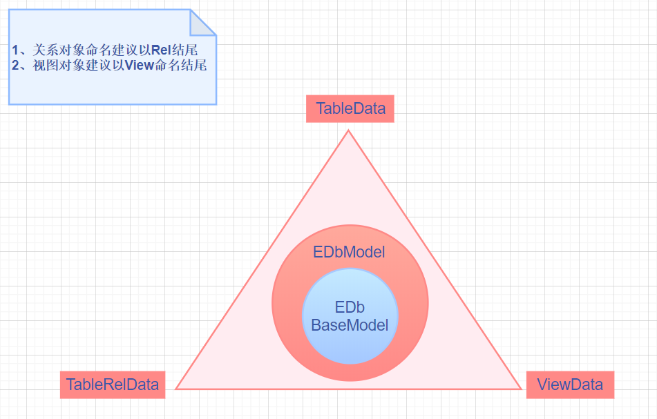

# EDb之 @EDbRel 案例介绍

### JPA使用指南 javax.persistence 的注解配置讲解
- @Table -- 基于 JPA 对象必须在实体类名上添加1个 @Table 注解，并指明数据库表的实际名称
- @Id -- 基于 JPA 对象必须至少指定1个主键字段申明
- @Column -- 基于 JPA 对象，@Column 是申明该属性字段对应的数据库实际名称，如果没有申明，则不会对数据库记录产生任何变化

### EDb自定义注解讲解
- @EDbSave 定义jpa保存前的执行方法
  - 作用域：
    - save(T)
    - batchSaveRid(class<T>,List<T>,int)
    - batchSave(class<T>,List<T>,int)
- @EDbUpdate 定义jpa更新前的执行方法
  - 作用域：
    - update(T)
    - update(class<T>,Map)
    - update(T1,T2)
    - batchUpdate(class<T>,List<T>,int)
    
- @EDbRel 定义关系对象
  - relKey -- 如果指定了，则可以通过key值的方式才能进行关系对象的动态赋值，例如使用 edbpro.getRelKey 方法
  - relColumn -- String[] 指定关联表相对字段，例如A表主键和B表的外键命名一样，即可直接维护，如果不是，请在 appendSql 里直接维护
  - appendSql -- 编写关联sql语句，以 and 或 or 开头，例如 and rel_id = #(p_id) , 意思是说关联对象的 rel_id 字段会获取当前源对象 上的 p_id 字段的值进行赋予，结果为 and rel_id = ? => and rel_id = 100
  - limit -- 在返回结果为list的时候有效,避免关联的是例如行为轨迹的表信息，可以有效的控制返回最近的轨迹信息
  - offset -- 可单向指定分页查询返回记录条数时，不用特意去统计获取结果，而是根据翻页传入 从第几条开始读取记录，节省开销时使用
  
- @EDbView 视图对象
  - name -- enjoy 模板里的模板名称，通常为返回查询的 select 语句，整合成视图对象，主要目的是将环绕对象的属性，可以直接作为参数传递到该sql模板视图里，然后直接返回视图结果

### EDb数据视图定义 
 

### EDb审计对象（监听对象）讲解
- EDbListener.java 定义全局jpa对象保存、更新前的方法，在 @EDbSave @EDbUpdate 定义的方法执行之前触发


**基于Java的相关用例**

- [基于 @EDbView 相关的测试案例](../../src/test/java/com/edb/cloud/jfinal/activerecord/db/jpa/EDbViewTest.java)

**基于 @EDbView 关联对象注解测试案例 -- 同步返回之测试案例 -- 基本常用的方式 **

# 首先定义 sql 视图文件内容，如下所示：

```sql

#sql("EDbViewTest")
select * from cr_vehicle_type
where 1=1
#### 假如 vehicleTypeId 不为null 则执行对应的sql
#if(vehicleTypeId)
and VEHICLE_TYPE_ID = #(vehicleTypeId)
#end
#### 假如 crVehicleTypeMode 不为 null,则判断 crVehicleTypeMode.vehicleModeName 是否不为null ，否则不做任何处理
#if(crVehicleTypeMode ? crVehicleTypeMode.vehicleModeName : false)
and VEHICLE_TYPE_NAME = '#(crVehicleTypeMode.vehicleModeName)'
#end
#### 假如 crVehicleTypeMode 不为 null,则判断 crVehicleTypeMode.isDel 是否不为null ，否则不做任何处理
#if(crVehicleTypeMode ? crVehicleTypeMode.isDel : false)
and is_del = '#(crVehicleTypeMode.isDel)'
#end

#end


```

ps: 大家会发现 enjoySql 非常的easy和简单明了，比现有的很多解析模板来说，非常好理解和应用，很舒服，而且还可以做更深的自定义和扩展


# 基于 @EDbView 视图对象的定义

```java
package com.edbplus.cloud.jfinal.activerecord.db.jpa.view;
import com.edbplus.cloud.jfinal.activerecord.db.annotation.EDbView;
import com.edbplus.cloud.jfinal.activerecord.db.jpa.model.CrVehicleType;
import com.edbplus.cloud.jfinal.activerecord.db.jpa.model.CrVehicleTypeMode;
import lombok.Data;
import java.util.List;

/**
 * 车辆视图
 */
@Data
public class VehicleView {

    // 查询可选对象1
    private Long vehicleTypeId;
    // 查询可选对象2
    private CrVehicleTypeMode crVehicleTypeMode;

    // 指定视图 -- 在sql模板里，可以通过配置 对象1 和 查询对象2 进行组合查询，对于入参和出参的定义也能更加清晰直观,同时代码检索也更加容易
    @EDbView(name = "test.EDbViewTest")
    private CrVehicleType crVehicleType;

    @EDbView(name = "test.EDbViewTest")
    private List<CrVehicleType> crVehicleTypes;

}

```


# 基于 @EDbView 视图对象查询应用时的测试案例

```java

package com.edbplus.cloud.jfinal.activerecord.db.jpa;
import com.edbplus.cloud.jfinal.activerecord.db.EDb;
import com.edbplus.cloud.jfinal.activerecord.db.base.BaseTest;
import com.edbplus.cloud.jfinal.activerecord.db.jpa.view.VehicleView;
import com.edbplus.cloud.jfinal.activerecord.db.jpa.model.CrVehicleTypeMode;
import lombok.extern.slf4j.Slf4j;
import org.testng.annotations.Test;

@Slf4j
public class EDbViewTest extends BaseTest {

    /**
     * 视图查询
     */
    @Test
    public void testView(){
     //
        VehicleView vehicleView = new VehicleView();
        // 指定id -- 将作为查询参数传递到视图对象里
        vehicleView.setVehicleTypeId(100L);
//        // 设置对象
//        CrVehicleTypeMode crVehicleTypeMode = new CrVehicleTypeMode();
//        crVehicleTypeMode.setIsDel(1);
//        vehicleView.setCrVehicleTypeMode(crVehicleTypeMode);
        log.info("========================================");
        // 返回查询的对象      ;
        System.out.println(EDb.getView(vehicleView).getCrVehicleType());
        // 返回查询列表
        System.out.println(EDb.getView(vehicleView).getCrVehicleTypes());
    }

}


```


```sql

2020-12-15 10:22:27.091 [,] [main] INFO  c.e.c.j.a.d.j.EDbViewTest - [testView,26] - ========================================
2020-12-15 10:22:27.251 [,] [main] INFO  c.a.d.p.DruidDataSource - [init,930] - {dataSource-3} inited
2020-12-15 10:22:27.267 [,] [main] DEBUG c.e.c.j.a.d.d.f.EDbDruidSqlLogFilter - [sqlLog,206] - edb-sql-?:  select * from (select * from cr_vehicle_type where 1=1 and VEHICLE_TYPE_ID = 100  ) as edb_findFirst_tb limit 2
2020-12-15 10:22:27.389 [,] [main] DEBUG c.e.c.j.a.d.d.f.EDbDruidSqlLogFilter - [sqlLog,207] - edb-sql-params: { }
2020-12-15 10:22:27.389 [,] [main] DEBUG c.e.c.j.a.d.d.f.EDbDruidSqlLogFilter - [sqlLog,229] - edb-sql-real:  select * from (select * from cr_vehicle_type where 1=1 and VEHICLE_TYPE_ID = 100  ) as edb_findFirst_tb limit 2
BaseCrVehicleType(vehicleTypeId=100, vehicleTypeName=罐车, creator=创建人-0, createTime=2020-11-08 17:00:26.0, modifier=null, modifyTime=2020-11-19 14:18:26.0, isDel=0)
2020-12-15 10:22:27.428 [,] [main] DEBUG c.e.c.j.a.d.d.f.EDbDruidSqlLogFilter - [sqlLog,206] - edb-sql-?: select * from cr_vehicle_type where 1=1 and VEHICLE_TYPE_ID = 100  
2020-12-15 10:22:27.428 [,] [main] DEBUG c.e.c.j.a.d.d.f.EDbDruidSqlLogFilter - [sqlLog,207] - edb-sql-params: { }
2020-12-15 10:22:27.428 [,] [main] DEBUG c.e.c.j.a.d.d.f.EDbDruidSqlLogFilter - [sqlLog,229] - edb-sql-real: select * from cr_vehicle_type where 1=1 and VEHICLE_TYPE_ID = 100  
Disconnected from the target VM, address: '127.0.0.1:49402', transport: 'socket'
[BaseCrVehicleType(vehicleTypeId=100, vehicleTypeName=罐车, creator=创建人-0, createTime=2020-11-08 17:00:26.0, modifier=null, modifyTime=2020-11-19 14:18:26.0, isDel=0)]

```

